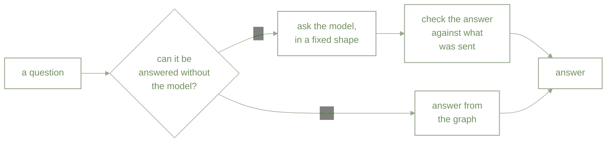
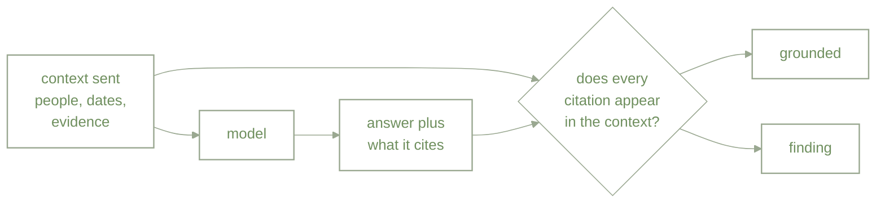

# Checking the Answer: What a Graph Can Verify, and What It Cannot

*Part 3 of 3 on the memory graph behind MindLocal. [Part 1](https://medium.com/@ganesh.kolekar/from-people-graph-to-memory-graph-designing-for-selective-recall-788ed4ed2e6b) covered how the graph is built. Part 2 covered how a question finds its evidence. This one is about whether the answer that comes back can be trusted.*

---

Here is a question the app got wrong.

> "Did Nora's birthday happen last week?"

Nora is not in the People list. She is not in any entry. She does not exist. The answer came back:

> "Nora's birthday did not happen last week. Nora's birthday is scheduled for August 2, 2026."

That date is real. It belongs to Rohan. The model took a fact it had been given, attached a name it had never seen, and wrote a confident sentence.

This is the failure worth designing against. Not the obvious nonsense, which anyone spots, but the answer that is fluent, specific, and indistinguishable from a correct one unless you go and check the source yourself.

Retrieval alone cannot prevent it. Part 2 was about choosing the right ten things to show the model. Everything in that pipeline was working here: the evidence was correct, the time window was correct. The model still produced a wrong answer from right inputs.

So the question for this post is narrower than "is the answer true". It is: **can we tell?**

## Three places to intervene

There are only three moments where anything can be done about it.

Before, during, and after. Each one catches something the others cannot.

## Before: some questions should never reach the model

The Nora question has a correct answer that requires no intelligence at all: *I have never heard of Nora.* Working that out is a lookup, not a judgement. Handing it to a model gains nothing and risks everything.

So a set of questions is answered from the graph directly, with no model call anywhere in the path:

**Someone who does not exist.** If a question names a person by possessive, "Nora's birthday", and that name matches nobody, the app says so and stops. Nothing that cannot happen can be invented.

**Someone who exists only in your writing.** There is a second case hiding behind the first. A name might be absent from your People list but present in a dozen entries. That deserves a different answer, and the graph already knows it, because unmatched names are stored as their own nodes. So the reply becomes: *Nora is not in your People list, but your notes mention her five times. Most recent: "Coffee with Nora" on 14 August.* Assembled from titles and dates, so it can state that she was mentioned without claiming anything about who she is.

**"When did I last see her?"** A real maximum over dated records is a computation. Small models are unreliable at scanning several dates and picking the true latest, so this is worked out in code and handed to the model as a settled fact rather than left as an exercise.

The principle is worth stating on its own. **If a question has a correct answer that can be computed, compute it.** A model asked a question it did not need to be asked is pure downside.

## During: make the answer say where it came from

For everything that does reach the model, the reply is no longer free text. It comes back in a fixed shape, with four extra fields alongside the prose:

- which numbered pieces of evidence were used
- every person named in the answer
- every date stated in the answer
- whether any part of it was general advice rather than something the context supported

None of that improves the answer. It makes the answer **checkable**, which is a different and more useful property.

There is a smaller version of the same idea one level down. Fields that must hold one of a fixed set of values, like the tone of an entry, are constrained so the model can only return one of them. Left as free text, a model asked for a tone will happily answer "positive", which is not one of the options, and the value quietly falls back to a default. A wrong stored fact that looks like a judgement call is much harder to notice than an error.

## After: check the citations against what was sent

The last step is the one the graph makes possible.

When the context is assembled, the app keeps a record of exactly what went into it: which pieces of evidence, which people, which dates. Not a summary. The actual list, produced by the same code that wrote the context, so the two cannot drift apart.

Then it is arithmetic. Every cited person has to appear in that record. Every stated date has to appear. Every evidence number has to exist. Anything that does not is reported.

On the Nora answer, this fires immediately. "Nora" is named in the reply and appears nowhere in the context. The date is real but belongs to a different person's event. The check does not need to understand birthdays to know something is wrong.

There is a softer finding too, for an answer that names people and states dates while citing no evidence at all. Nothing has been proved invented. It simply cannot be checked, which is worth knowing on its own, because it is the shape a confident guess takes.

## What this catches, and what it does not

Here is the honest boundary, and it matters more than any of the machinery above.

This catches **invented references**. A person who was never mentioned. A date that appears nowhere. A source that does not exist.

It does not catch **a real source described wrongly**. If the answer says "evidence 2 shows the meeting went badly" and evidence 2 exists, every check passes, whatever evidence 2 actually says.

So "grounded" means *invented nothing*. It does not mean *is true*. Those are different claims, and conflating them would be a worse error than the one being fixed, because it would make a wrong answer look verified.

Closing that last gap means judging whether a piece of text supports a claim, which is a harder problem than everything described here put together, and not one a graph can settle.

## Checking the checker

A verifier that is itself wrong is worse than none at all, because it launders a bad answer into a trusted one. So the question turns around: what evidence is there that these checks work?

The useful property is that not one of them is a judgement. Every check is set membership — is this evidence number inside the range that was sent, is this name among the names that were sent, is this date one of the dates. That makes them ordinary code with exact expected outcomes, tested rather than sampled and scored. The Nora answer is no longer an anecdote either; it is a fixture, and the check has to name "Nora" every time it runs.

Which lets the suite assert in both directions. The second one matters more than it looks:

**It fires when it should.** An evidence number outside the range that was sent. A person named nowhere in the context. A date no node carries.

**It stays quiet when it should.** An answer that says "Lilly" where the context said "Lilly Kolekar" is correct, and flagging it would be a false alarm. General advice that cites nothing is not a confabulation; it is general advice, and it is deliberately left alone.

That asymmetry is the whole design constraint. A check that misses something occasionally is still worth having. A check that cries wolf gets switched off, and then it catches nothing at all — which is not a hypothetical, because there is a toggle for these checks in the app's settings. The first thing a noisy verifier costs you is its own existence.

What none of this measures is whether the answer was *true* — that boundary was drawn above. Worth adding is why it is not a matter of simply trying harder. The obvious way to judge whether a passage supports a claim is to ask a model, which puts the thing under test into the judge's chair. Every check described here earns its trust by refusing to ask a question that a lookup cannot settle.

## What it gets us

Three answers can now be told apart, where before they all looked the same:

**Grounded.** Every reference resolves to something the model was actually shown.

**Unverifiable.** Specific claims, no citations. Possibly right, but nothing supports it.

**Wrong.** A reference that does not exist, named precisely.

That last distinction is the useful one. Knowing an answer is unverifiable is not as good as knowing it is false, but it is far better than not knowing which of the two you are looking at.

None of this makes the model more accurate. It makes the system honest about what it knows, and that turns out to be the part you can build on.

---

*This is the last post in the series. Part 1 covered the shape of the graph, part 2 how a question finds its evidence, and this one what happens to the answer afterwards.*
